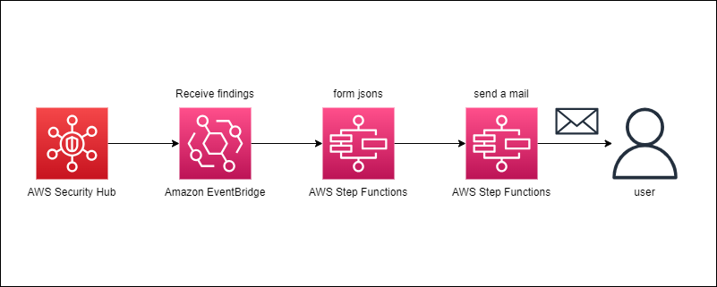
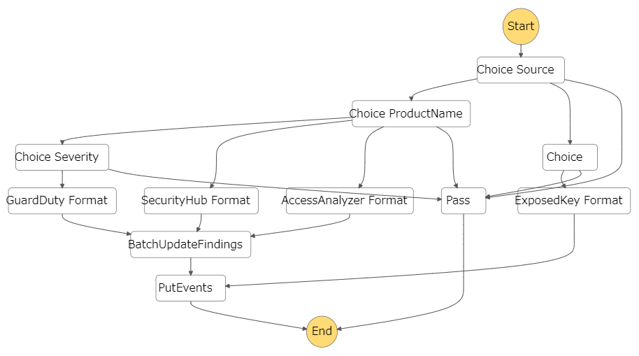

# security-hub-aggregator

A tool that aggregate findings from AWS Security Hub.

## Architecture

## Work Flow

## Deployment

If you had already installed AWS SAM, it's a only command below.

> sam deploy --guided

## Warning

- Be careful with a eventbridge's rule, because this tool may send too many messages.
  - It may lead to overcharging especialy AWS Step Functions.
